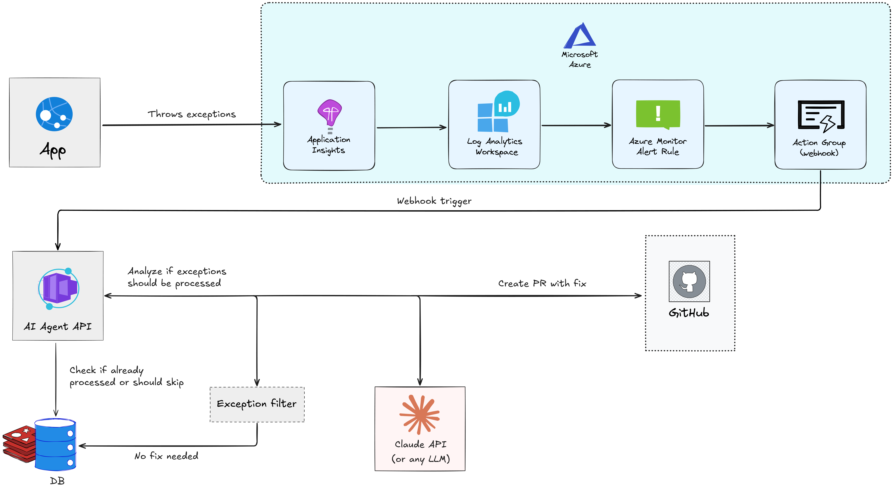

# AI Diagnostics Agent

An AI-powered agent that monitors Application Insights, analyzes exceptions, and automatically creates Pull Requests with fixes.

> **Read the full article on Medium**: [From Exceptions to Pull Requests: Building a Self-Fixing .NET 10 App with AI Agents](https://medium.com/@jbeyondstars/building-a-self---fixing-net-10-app-with-ai-agents-e8605cb11a99)



> **Note**: This is a prototype project built for demonstration purposes. There's room for improvements (better error handling, more robust testing, production hardening, etc.). Contributions and feedback are welcome!

## How It Works

1. **Exception occurs** in your application
2. **Azure Monitor Alert Rule** detects it (KQL query every 5 min)
3. **Webhook triggers** the AI Agent API
4. **Agent fetches** exception details + source code
5. **Claude analyzes** and proposes a fix
6. **PR is created** on GitHub

## Quick Start

### Prerequisites

- .NET 10.0 SDK
- Anthropic API key
- Azure subscription with Application Insights
- GitHub Personal Access Token

### Configuration

```bash
cd src/Agent.Api

# Anthropic
dotnet user-secrets set "Agent:Llm:Anthropic:ApiKey" "sk-ant-..."
dotnet user-secrets set "Agent:Llm:Anthropic:Model" "claude-sonnet-4-5-20250929"

# Application Insights
dotnet user-secrets set "Agent:AppInsights:WorkspaceId" "your-workspace-id"

# GitHub
dotnet user-secrets set "Agent:GitHub:Token" "github_pat_..."
dotnet user-secrets set "Agent:GitHub:Owner" "your-org"
dotnet user-secrets set "Agent:GitHub:Repo" "your-repo"
```

### Run Locally

```bash
cd src/Agent.Api
dotnet run
```

### Deploy to Azure

```bash
azd env set ANTHROPIC_API_KEY "sk-ant-..."
azd env set GITHUB_TOKEN "github_pat_..."
azd env set GITHUB_OWNER "your-org"
azd env set GITHUB_REPO "your-repo"
azd up
```

## Project Structure

```
src/
├── Agent.Api/           # HTTP API (webhook endpoints)
├── Agent.Core/          # Main orchestration logic
└── Agent.Plugins/       # Semantic Kernel plugins (AppInsights, GitHub)

infra/
├── main.bicep           # Main infrastructure
└── alert-rule.bicep     # Azure Monitor Alert Rule
```

## API Endpoints

| Endpoint | Description |
|----------|-------------|
| `POST /api/diagnostics/webhook/alert` | Azure Monitor webhook |
| `POST /api/diagnostics/analyze-latest` | Analyze most recent exception |
| `GET /api/diagnostics/test-appinsights` | Test connections |

## Configuration

| Variable | Description |
|----------|-------------|
| `Agent__Llm__Anthropic__ApiKey` | Anthropic API key |
| `Agent__Llm__Anthropic__Model` | Model ID (e.g., `claude-sonnet-4-5-20250929`) |
| `Agent__AppInsights__WorkspaceId` | Log Analytics Workspace ID |
| `Agent__GitHub__Token` | GitHub PAT |
| `Agent__GitHub__Owner` | GitHub organization/user |
| `Agent__GitHub__Repo` | Target repository |

## License

MIT
